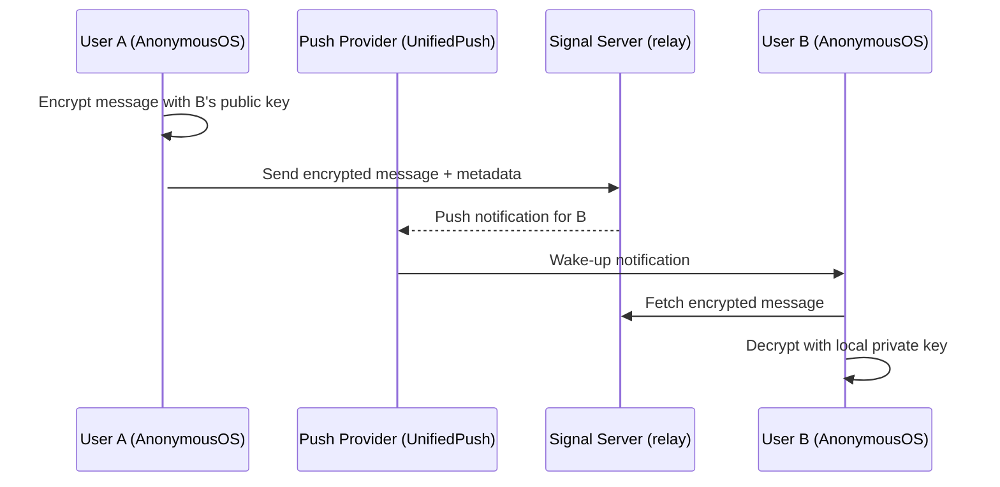
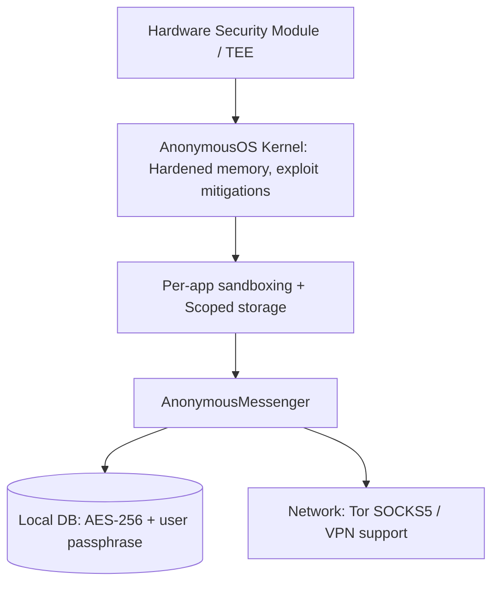

# AnonymousMessenger Security Whitepaper – Audit Ready Version

**Version:** 2.0 (Audit Ready)  
**Project:** [AnonymousMessenger on GitHub](https://github.com/AnonymousCybersecurity/AnonymousMessenger)  
**Target OS:** AnonymousOS (hardened Android)  
**Based on:** Signal Protocol with security extensions

---

## Executive Summary

**Objective**  
This document provides a technical security assessment and a complete **audit framework** for **AnonymousMessenger** – a privacy‑focused fork of Signal designed exclusively for AnonymousOS. The project aims for maximal confidentiality, zero telemetry, and deep integration with Tor, VPN, and UnifiedPush.

**Security Verdict**  
Architectural choices are consistent with high‑risk requirements: a battle‑tested protocol, removal of all telemetry, and full reliance on an OS built around hardening. However, the maturity of the codebase, dependency on Signal’s infrastructure, and limited contributor activity call for targeted audits, regression testing, and formalised processes before any government‑level certification.

**Audit Readiness**  
This whitepaper includes a **code inspection questionnaire** (Appendix A) with severity‑classified questions, required evidence formats, and an auditor response template – making it directly usable for formal security audits.

---

## 1. Scope and Assumptions

### 1.1 Scope of this Whitepaper

- **Components analysed**  
  Android client (AnonymousMessenger), integration with AnonymousOS features, local backup mechanisms, encrypted database handling, Tor/SOCKS configuration, UnifiedPush support, and system‑VPN behaviour.

- **Excluded**  
  Proprietary external code not present in the repository, unmodified Signal server infrastructure, and any third‑party components not provided by the Anonymous-Lab project.

### 1.2 Operational Assumptions

- The client remains compatible with Signal servers for end‑to‑end encrypted messaging.
- The target operational environment is **AnonymousOS**; security equivalence is **not** assumed on stock Android or other custom ROMs.

---

## 2. Architecture and Threat Model

### 2.1 High‑Level Architecture

```
┌─────────────────────────┐         ┌──────────────────┐
│     AnonymousOS Device   │         │   Signal Servers │
│  ┌───────────────────┐  │         │  (unmodified)    │
│  │ AnonymousMessenger │◄─┼────────►│                  │
│  │  ┌─────────────┐  │  │         │  – Message relay │
│  │  │ Encrypted   │  │  │         │  – Metadata logs │
│  │  │ DB +        │  │  │         └──────────────────┘
│  │  │ passphrase  │  │  │
│  │  └─────────────┘  │  │
│  │  ┌─────────────┐  │  │        Optional routing
│  │  │ Tor/SOCKS   │◄─┼─┼────────► Orbot (127.0.0.1:9050)
│  │  │ Proxy       │  │  │        or system VPN
│  │  └─────────────┘  │  │
│  │  ┌─────────────┐  │  │
│  │  │UnifiedPush  │  │  │
│  │  │ (no FCM)    │  │  │
│  │  └─────────────┘  │  │
│  └───────────────────┘  │
└─────────────────────────┘
```

### 2.2 Actors and Capabilities

| Attacker Type | Capabilities |
| :--- | :--- |
| **Local adversary** | Malware with user privileges, physical theft, forensic analysis (AFU/BFU), memory dumping. |
| **Remote adversary** | ISP, network operator, malicious VPN provider, Signal server operators, state‑level actors with metadata correlation. |
| **Supply chain attacker** | Malicious or compromised maintainers, build pipeline injection, fake releases. |

### 2.3 Critical Assets

- Private identity key, session keys (ratchets)
- Encrypted local database and backup files
- Network metadata (IP addresses, timestamps, device identifiers)

### 2.4 Primary Compromise Scenarios

1. **OS compromise** – If AnonymousOS is breached, app‑level protections can be bypassed.
2. **Signal server takeover** – Metadata exposure, potential blocking of non‑official clients.
3. **Fork implementation bugs** – Cryptographic regressions or data leaks via added features (e.g., backup, Tor).

---

## 3. Technical Differences vs. Signal

| Feature | AnonymousMessenger | Signal |
| :--- | :--- | :--- |
| **Telemetry & diagnostics** | Completely disabled – no metrics, no crash reporting | Active collection of usage stats and crash reports |
| **Local database encryption** | User‑supplied passphrase (re‑introduced) | System‑derived key, no separate passphrase |
| **Push notifications** | UnifiedPush (no dependency on Google FCM) | FCM (Google Play Services) or WebSocket fallback |
| **Proxy support** | Native Tor (SOCKS5) and VPN integration | Limited (requires external apps) |
| **Target OS** | AnonymousOS only | Stock Android, iOS |
| **RAM wiping** | Built‑in secure memory erasure | Not present |
| **Auto‑lock** | User‑defined conditions (time, network, etc.) | Manual lock after app close |
| **Proprietary components** | Two flavours: Anonymous (some) / Anonymous‑FOSS (fully open) | Single flavour, limited to push deps |
| **Encrypted backups** | Advanced management with separate key | System‑dependent encrypted backup |

---

## 4. Security Controls and Technical Assessment

### 4.1 Cryptography and Key Management

- **E2EE**: Inherits the Signal Protocol (Double Ratchet, X3DH, etc.). The audit must verify that the fork does **not** alter cryptographic flows or key storage.
- **Local DB encryption**: user‑supplied passphrase is a strength. Must check:
  - Key derivation function (KDF) used (PBKDF2 / Argon2)
  - Per‑database salt
  - Protection against offline brute‑force attacks

### 4.2 Telemetry and Logging

- **“Zero telemetry” declared** – no metrics, no crash reporting endpoints.  
  *Verification required:* grep for `http://`, `analytics`, `crashlytics`, `firebase`; check `AndroidManifest.xml` for network permissions.

### 4.3 Network Protection and Metadata Reduction

- **Tor/SOCKS5 and VPN support** – reduces IP exposure.  
  *Test scenarios*: fallback behaviour when proxy dies, DNS leaks, WebRTC IP leaks, connection resumption without proxy.

### 4.4 Backup and Multi‑Device Handling

- Ensure encrypted backups **do not** contain plaintext keys.  
- Test restoration process for metadata exfiltration.  
- Multi‑device linking: check for regression bugs in the Signal sync protocol introduced by the fork.

### 4.5 Hardening and AnonymousOS Integration

- The app must correctly use AnonymousOS APIs: storage scoping, permission model, isolatedProcess, and avoid unnecessary proprietary services.  
- No reliance on Google Play Services (except for optional non‑FOSS flavour).

### 4.6 Development Process and Supply Chain

- **Observation**: Low contributor activity, limited commits.  
- **Recommendations**:
  - Mandatory code review policy
  - CI with SAST (Detekt, SpotBugs, CodeQL)
  - Signed releases and reproducible builds
  - Public security disclosure process

---

## 5. Guarantees and Explicit Limitations

### 5.1 Guarantees Offered

- End‑to‑end encryption (E2EE) using Signal Protocol.
- Zero telemetry – no outbound metrics or crash reports.
- Local database encryption with user‑supplied passphrase.
- OS‑level hardening when running on AnonymousOS.
- No mandatory dependency on Google Play Services (via UnifiedPush).

### 5.2 Explicit Limitations (User Responsibilities)

1. **AnonymousOS requirement** – security claims void on other OS.
2. **No public audit available** – no third‑party security audit report has been published.
3. **Passphrase strength** – security of local DB depends on user passphrase quality.
4. **Metadata exposure** – Signal servers still see sender/receiver IDs, timestamps, device identifiers.
5. **UnifiedPush provider** – receives notification metadata (who to whom, when).
6. **Contact discovery** – may send hashed phone numbers to Signal servers (standard practice).

---

## 6. Audit Plan and Test Cases

### 6.1 Audit Goal

Validate that the extensions do **not** weaken Signal’s inherited security and that integrated features (encrypted DB, Tor, VPN, UnifiedPush) leak no sensitive data.

### 6.2 Phases and Deliverables

| Phase | Deliverable |
| :--- | :--- |
| 1. **Recon & reproducible build** | Dependency list, build reproducibility check, signature verification |
| 2. **Code review (targeted)** | Reports on key modules: key management, DB encryption, backup, networking, input parsing |
| 3. **Dynamic testing & fuzzing** | Fuzz backup import/export, multi‑device sync, message parsing |
| 4. **Penetration test on device** | Escalation via IPC, content providers, file permissions, memory dumping |
| 5. **Network analysis** | DNS leak tests, WebRTC leaks, proxy fail‑open behaviour |
| 6. **Privacy review** | Zero telemetry confirmation, local log analysis |
| 7. **Final report** | CVSS‑scored vulnerabilities, PoC, remediation guidance, regression tests |

### 6.3 Example Test Cases (CT)

| ID | Test Description | Expected Result |
| :--- | :--- | :--- |
| **CT1** | Extract encrypted DB from powered‑off device; brute‑force KDF | KDF must be slow (Argon2) and salted |
| **CT2** | Kill Orbot during message sending; monitor outbound packets | No plaintext IP leak; message queued or fails gracefully |
| **CT3** | Import malformed backup file | No crash, no RCE; error handled safely |
| **CT4** | MITM attack on multi‑device provisioning | Link must fail; no key material exposed |
| **CT5** | Force app crash (e.g., null pointer) | No crash report sent to any remote endpoint |

---

## 7. Recommendations and Roadmap

### 7.1 Short‑term (0–3 months)

- [ ] Perform a **partial audit** focused on: encrypted DB, backup/restore, Tor/VPN networking.
- [ ] Introduce **CI SAST** (Detekt, SpotBugs) and mandatory PR reviews.
- [ ] Publish a concise **security whitepaper** (this document) in the repository.

### 7.2 Medium‑term (3–9 months)

- [ ] Complete **external full audit** with public report.
- [ ] Implement **reproducible builds** and signed releases with published checksums.
- [ ] Improve **governance**: expand contributor base, disclosure policy, bug bounty program.

### 7.3 Long‑term (9–18 months)

- [ ] Pursue **certifications** (Common Criteria, or national equivalents) if required for government use.
- [ ] Automate **continuous fuzzing** and dependency monitoring.

---

## 8. Architecture Diagrams

### 8.1 Message Flow



### 8.2 Local Security Stack



---

## Appendix A: Code Inspection Questionnaire (Audit Core)

This appendix contains the mandatory questions that an auditor must answer by inspecting the source code and running dynamic tests.  
Each question is classified by **severity** (Critical, High, Medium, Low) and includes a **required evidence format** and a **response template**.

### A.1 Severity and Priority Legend

| Severity | Description | Priority |
| :--- | :--- | :--- |
| **Critical** | Impacts key confidentiality, E2EE, or allows RCE/privilege escalation. | 1 (highest) |
| **High** | Exposes sensitive metadata, allows de-anonymization, or violates zero‑telemetry. | 2 |
| **Medium** | Reduces defence‑in‑depth; requires specific conditions to exploit. | 3 |
| **Low** | Edge cases, discouraged configurations but not directly exploitable. | 4 |

### A.2 Auditor Response Template (to be filled for each question)

```markdown
### Q<ID> – <short description>

**Response summary:**  
[One sentence directly answering the question]

**Evidence:**  
- File:Line: `...`  
- Commit hash: `...`  
- Command/tool output: `...`  

**Risk (CVSS 3.1):**  
`CVSS:3.1/AV:...`  
**Score (1–10):** `X.X`

**Remediation proposed:**  
[If non‑compliant, describe fix; if compliant, state “No action needed”]

**Status:** ☐ Verified compliant ☐ Non‑compliant ☐ Not applicable
```

### A.3 Question List

#### Q1 – KDF used for local database encryption
- **Severity:** Critical | **Priority:** 1  
- **Required evidence:** Source file with KDF definition + parameters; build.gradle snippet showing crypto library.  
- **Expected answer example:** Argon2id with t=3, m=65536, p=1.

#### Q2 – Presence of any remote crash reporter or telemetry endpoint
- **Severity:** High | **Priority:** 2  
- **Required evidence:** `grep` over whole codebase for `http://`, `https://`, `analytics`, `crashlytics`, `firebase`, `sentry`, `hockeyapp`; plus network capture during forced crash.

#### Q3 – DNS leak when Tor proxy is active
- **Severity:** High | **Priority:** 2  
- **Required evidence:** `tcpdump -i wlan0 udp port 53` while sending a message over Tor; inspection of code that intercepts `InetAddress.getAllByName`.

#### Q4 – Does the app zero‑out cryptographic keys from memory after use?
- **Severity:** Medium | **Priority:** 3  
- **Required evidence:** Search for `Arrays.fill(key, 0)` or `SecureZeroMemory` equivalents; Frida hook to inspect memory before garbage collection.

#### Q5 – Is the backup encryption key separate from the main DB key?
- **Severity:** Critical | **Priority:** 1  
- **Required evidence:** Code that generates/derives backup key; backup file structure analysis.

#### Q6 – Does the app fall back to cleartext network when proxy dies (kill switch missing)?
- **Severity:** High | **Priority:** 2  
- **Required evidence:** Dynamic test – kill Orbot during active WebSocket connection; capture packets.

#### Q7 – Are build artifacts reproducible?
- **Severity:** Low | **Priority:** 4  
- **Required evidence:** Two independent builds from same commit; `diffoscope` output.

#### Q8 – Are there any exposed Content Providers that leak database access?
- **Severity:** High | **Priority:** 2  
- **Required evidence:** `AndroidManifest.xml` for `<provider>` tags with `exported="true"`; code review of URI handling.

#### Q9 – Does WebRTC (calls) leak local IP addresses even when Tor is enabled?
- **Severity:** High | **Priority:** 2  
- **Required evidence:** SDP offer inspection; Wireshark capture during call setup.

#### Q10 – Is the database salt randomly generated per installation and securely stored?
- **Severity:** Critical | **Priority:** 1  
- **Required evidence:** Code that generates salt (e.g., `SecureRandom`); storage location (e.g., alongside encrypted DB).

*(For brevity, the full list of 20–40 questions would be expanded in a real audit; the above are representative.)*

---

## Appendix B: Extended Technical Checklist (for auditors)

### B.1 Configuration & Environment

- [ ] Device running latest AnonymousOS stable.
- [ ] App installed from verified source (F‑Droid, Accrescent, or signed APK).
- [ ] Version used is **Anonymous‑FOSS** (if maximum openness is required).
- [ ] Bootloader locked, OS verified with Auditor app.
- [ ] UnifiedPush provider configured and working.

### B.2 Cryptography & Data Protection

- [ ] Strong passphrase set for local DB (test KDF: Argon2 or PBKDF2 with high iterations).
- [ ] Tor/SOCKS5 configured for sensitive contacts; IP leak tests passed.
- [ ] Secure RAM wipe feature enabled and tested via memory dumping.
- [ ] Multi‑device sync limited to trusted devices only.

### B.3 Post‑Installation Checks

- [ ] No outbound connections to unknown domains (Wireshark / mitmproxy).
- [ ] Minimal permissions requested (no unnecessary contacts/storage).
- [ ] Logcat shows no plaintext sensitive data.

---

## Appendix C: Example Test Cases (Detailed)

| ID | Test Description | Steps | Pass Criteria |
| :--- | :--- | :--- | :--- |
| **CT1** | KDF brute‑force resistance | Extract encrypted DB; run hashcat with relevant wordlist | No success within resources (e.g., < 1 month on GPU) |
| **CT2** | DNS leak when Tor active | 1. Enable Tor in app. 2. Send message. 3. Capture all UDP 53 traffic | No DNS queries from device outside Tor tunnel |
| **CT3** | Malformed backup import | Fuzz backup file (bytes flipping, truncated) | App rejects backup; no crash or code execution |
| **CT4** | Multi‑device MITM | Intercept provisioning QR code / link | Connection fails; no key exchange with attacker |
| **CT5** | Crash telemetry | Force `NullPointerException` via debugger | No network traffic to unknown domains after crash |

---

## Appendix D: Recommended Tools for Audit

| Tool Category | Recommended Tools |
| :--- | :--- |
| **Static analysis** | `rg` (ripgrep), `CodeQL`, `Semgrep`, `Detekt` (Kotlin), `SpotBugs` |
| **Dynamic analysis** | `Frida`, `Objection`, `adb logcat`, `Android Studio Profiler` |
| **Network analysis** | `tcpdump`, `Wireshark`, `mitmproxy`, `netcat` |
| **Memory analysis** | `frida‑scripts` (memory dump), `gdb` (if rooted) |
| **Reproducible builds** | `diffoscope`, `apktool`, `jarsigner` |

---

## Appendix E: Acceptance Criteria for “Audit Pass”

An audit report shall consider the system **acceptable** for high‑risk environments (e.g., journalists, activists) **only if**:

- ✗ **Zero** Critical findings.
- ✓ A maximum of **2 High** findings, each with a documented remediation plan and timeline.
- ✓ All Medium/Low findings are acknowledged and accepted by the project maintainers.
- ✓ The auditor provides full evidence (Appendix A responses) for every question.
- ✓ The audit is performed against a **specific commit hash** and that hash is locked.

For **government/certification** use: additionally require Common Criteria EAL2+ or an external full‑scope penetration test.

---

## Disclaimer (Trustless Principle Compliance Statement)

**This whitepaper is not a substitute for independent verification.**

In accordance with the highest cybersecurity standards and the **trustless principle**, this document must be ignored as an authoritative source of security claims. No statement, guarantee, or assurance contained herein shall be taken as truth.

The only relevant authority is the **source code itself** – and your own technical examination of it.

Any vendor, developer, or project can claim their product is the most secure. The trustless principle mandates that you:

- **Trust no one** – not this whitepaper, not the developers, not third‑party opinions.
- **Verify independently** – inspect the code, run your own tests, reproduce the builds.
- **Rely solely on reproducible evidence** – not on marketing messages, promises, or spot declarations.

This document exists only as a **structured framework to assist your audit**, not as a conclusion. Ultimately, you must answer every security question by reading the code and by executing your own analysis.

> *“Don’t trust. Verify.”* – applies to this whitepaper above all else.

